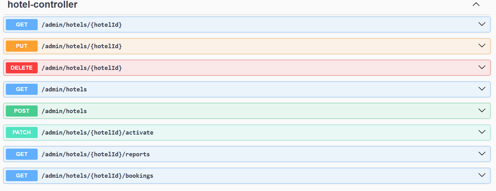
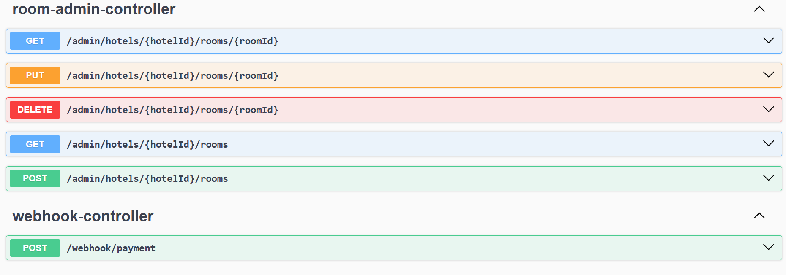
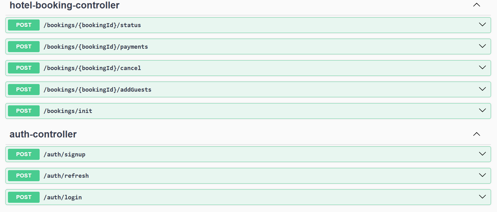
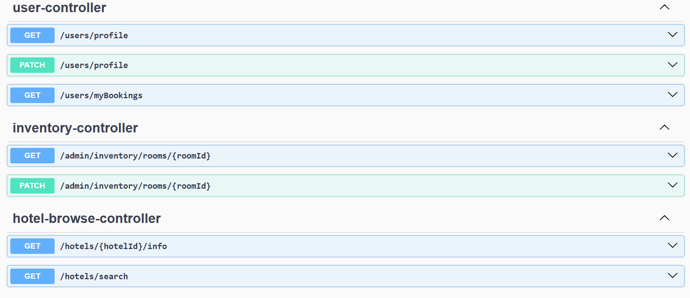

<p align="center">
  
</p>

**AirBnbEx** is a fully functional, full-stack backend system inspired by Airbnb. It enables users to browse, book, and manage hotel rooms with a modern and modular architecture. The project uses **Spring Boot**, **JWT authentication**, and integrates with **Stripe** for payment handling.

🚀 Designed with scalability, security, and extensibility in mind.

---

## 🎯 Features

- ✅ User authentication and role-based access control (JWT)
- 🏨 Hotel listing, filtering, and browsing
- 📆 Room availability & inventory management
- 💳 Secure payments via Stripe API
- 💸 Dynamic pricing engine using the **Decorator Design Pattern**
- 🌐 RESTful APIs with Swagger documentation
- 🧩 Clean, modular service-controller-repository architecture

---

## 📡 API Endpoints

Here are the key REST API endpoints:










## 🛠️ Tech Stack

| Layer        | Technologies Used                                      |
|-------------|---------------------------------------------------------|
| Backend      | Java 24, Spring Boot, Spring Security, JPA             |
| Database     | PostgreSQL (Locally) / AWS RDS (Production)            |
| Authentication | JWT (JSON Web Tokens)                              |
| Payments     | Stripe Payment Gateway                                 |
| API Docs     | Swagger / OpenAPI                                      |
| Deployment   | AWS Elastic Beanstalk + RDS                            |

---

## 🧠 Design Patterns

**Decorator Design Pattern** has been elegantly used for the **Dynamic Pricing Engine** — allowing us to flexibly compose different pricing strategies (like discounts, surcharges, taxes) at runtime without modifying the core logic.

---

## ☁️ Production Deployment

**AirBnbEx** is built to scale and was successfully deployed on:

- **AWS Elastic Beanstalk** for hosting the backend  
- **AWS RDS (PostgreSQL)** for a managed, scalable database```

---

## 🧾 Architecture Overview

- **Controller Layer**: Handles HTTP requests and delegates to services  
- **Service Layer**: Business logic and pricing decorators  
- **Repository Layer**: JPA Repositories for database access  
- **Exception & Response Handlers**: Centralized error handling  
- **Stripe Integration**: For secure transactions

## 🚀 Running the Project Locally

### ✅ Prerequisites

- Java 17+
- Maven
- PostgreSQL (or update DB config)
- Stripe Developer Keys

Use an `.env` file or export the following variables in your shell:

```env
SPRING_APPLICATION_NAME=airBnbApp

# DB Configuration
SPRING_DATASOURCE_URL=jdbc:postgresql://localhost:5432/airBnb
SPRING_DATASOURCE_USERNAME=your_db_user
SPRING_DATASOURCE_PASSWORD=your_db_password

# JPA Settings
SPRING_JPA_HIBERNATE_DDL_AUTO=update
SPRING_JPA_SHOW_SQL=true
SPRING_JPA_PROPERTIES_HIBERNATE_FORMAT_SQL=true
SERVER_SERVLET_CONTEXT_PATH=/api/v1

# JWT and Stripe
JWT_SECRET_KEY=your_jwt_secret
STRIPE_SECRET_KEY=your_stripe_secret
STRIPE_WEBHOOK_SECRET=your_webhook_secret

# Frontend
FRONTEND_URL=http://localhost:8080
```
---

## ✨ Author

Developed by **Vineet Uppal**  
Feel free to ⭐️ the repo if you found it useful!
